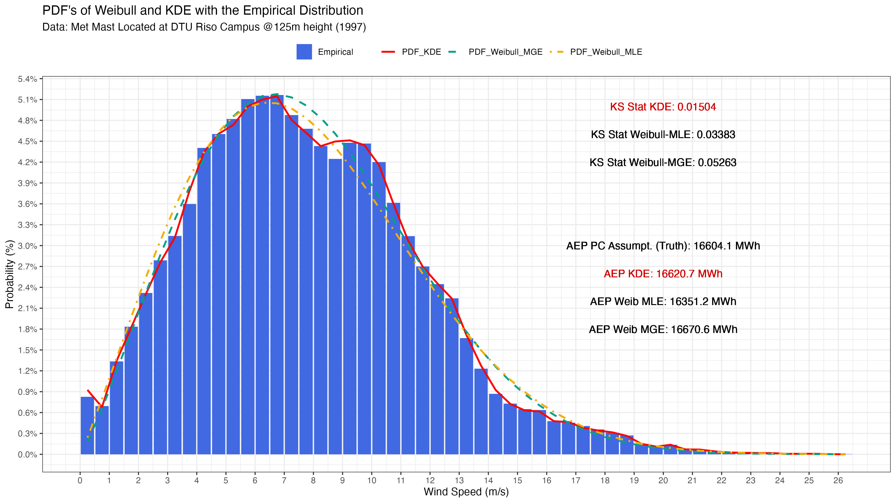

# Comparison of the well-known parametric Weibull with non-parametric KDE for Wind Enegy Applications

This repository contains the code, and a final documentation for the study that compares the Weibull distribution with Kernel Density Estimation (KDE) for wind speed modeling. This study aims to provide insights into improving wind energy assessments.

## Key Findings

**KDE Outperforms Weibull:** Our analysis demonstrates that KDE offers a better fit to observed wind speed data compared to the traditional Weibull disztribution. This conclusion is supported by the Kolmogorov-Smirnov test.

**Reduced AEP Error:** When it comes to Annual Energy Production (AEP) calculations, KDE reduces the error.

Although I would like to show how using the Weibull distribution in AEP calculations can lead to large errors, I was unable to find data for a complex site, so I am content to present these results.

In my experience through working as wind resource asessment engineer in different companies, I have faced lots of complex sites located in Turkey and the weibull fit unfortunately doesn't represent the empirical distribution most of the time. That's why it's very important to implement other fitting methodologies or non-parametric distributions to the worldwide known softwares like WAsP, windPRO or Meteodyn.

To replicate our analysis and explore the findings, follow these steps:

1. Clone the repository to your local machine.
2. Download the data from this **[link](https://gitlab.windenergy.dtu.dk/fair-data/winddata-revamp/winddata-documentation/-/blob/master/risoe_m.md)**.
3. Follow the R or Rmd files.

The resulted final plot with KS-Statistic and AEP in MWhs is seen below.

